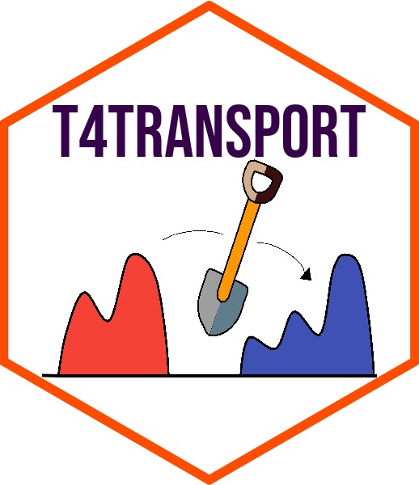

<!-- README.md is generated from README.Rmd. Please edit that file -->

# Tools for Computational Optimal Transport in R

<!-- badges: start -->

[](https://CRAN.R-project.org/package=T4transport)
<!-- badges: end -->

<p align="center">

<a href="https://www.kisungyou.com/T4transport/">

</a>
</p>

We introduce **T4transport**, an **R** package designed as a
computational toolkit that compiles a collection of algorithms in the
field of optimal transport.

## Installation

- Option 1 : **released** version from
  [CRAN](https://CRAN.R-project.org).

``` r
install.packages("T4transport")
```

- Option 2 : **development** version from
  [GitHub](https://github.com/kisungyou/T4transport).

``` r
# install.packages("devtools")
devtools::install_github("kisungyou/T4transport")
```
